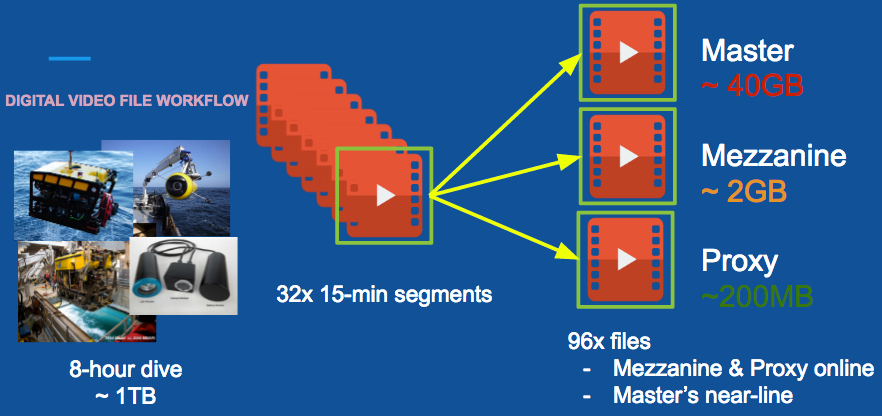

# vampire-squid

Vampire-squid is a video asset manager.

[](https://travis-ci.org/mbari-media-management/vampire-squid)

## tl;dr

If your video capture looks something remotley like the image below, then this video asset manager may be useful for you:



## Quickstart

```
docker -p 8080:8080 --name vampire-squid mbari/vampire-squid
```

See also <https://github.com/mbari-media-management/m3-microservices> for a project for spinning up all M3 microservices.

## Overview

vampire-squid is a video asset manager for tracking videos from camera deployments. Typically, the video from a single deployment is chunked into segments (to be small enough to be manageble). Each chunk may have several representations at different resolutions and codecs. Vampire-squid tracks these videos as a unit. It also stores the single most important bit of data needed for scientific research: The date/time that each frame in a video was recorded.

## Data Model

The data model is:

```
VideoSequence-[1]---[0..*]->Video-[1]---[0..*]->VideoReference 
```

- `VideoSequence` is essentially a single deployment/session from a single camera. Analagous to a _dive_. Typically, a deployment is broken into segments, e.g. 5 minutes, in order to make the files sizes manageable. This seems to be the current practice among all the groups at the underwater video workshop in RI. 
- `Video` is an abstraction that refers to a single segment in the _VideoSequence_. It tracks the start date and duration of a segment of video. It's an abstraction as it does not point directly to a video via a URL or path as there will likely be multiple representations of the same video segement (such as digital master, mezzanine, and various proxies)
- `VideoReference` is a concrete reference to a representation of a _Video_. It stores the particulars of a file needed to locate a video. It encapsulates the codecs, containers, size and location of a video file.

## How-to

- [Setup your own database](src/site/docs/HOWTO_DATABASE_SETUP.md)

## Data store

The current data storage targets are SQL Databases. Pretty much all database servers are supported. You can configure the database info in the [application.conf](src/pack/conf/application.conf) file. The database schema will be auto-generated the first time you run the application. 

Note that you will need to include you database's JDBC driver. There's a variety of ways to do it but the simplest for non-developers is to drop the driver's jar file in the build's `lib` directory. 

The default setup is to use an in-memory derby database. This is useful for testing and development, but as configured, you lose your data when you stop the application.

## Build and Run

To build: 

```
sbt pack
```

To run:

```
cd target/pack/bin
jetty-main
```

You can do a quick test by pointing to the server through a web browser at: <http://localhost:8080/v1/videosequence>
    
That will dump your entire database out as JSON. 

## API

__Coming soon__. Right now there's an example python script that demo's adding data: [simple_setup.py](src/pack/bin/simple_setup.py)


## TODO


This project is built using [SBT](http://www.scala-sbt.org/). See SBT.md for help.

